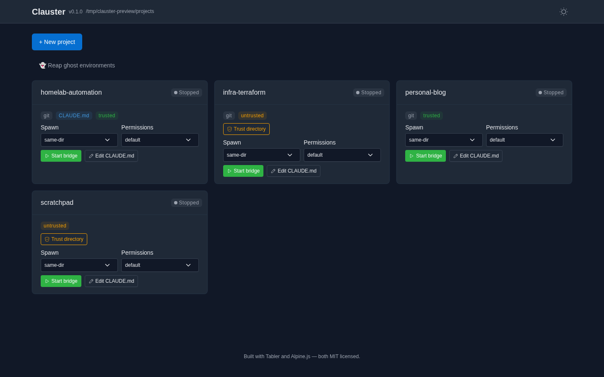
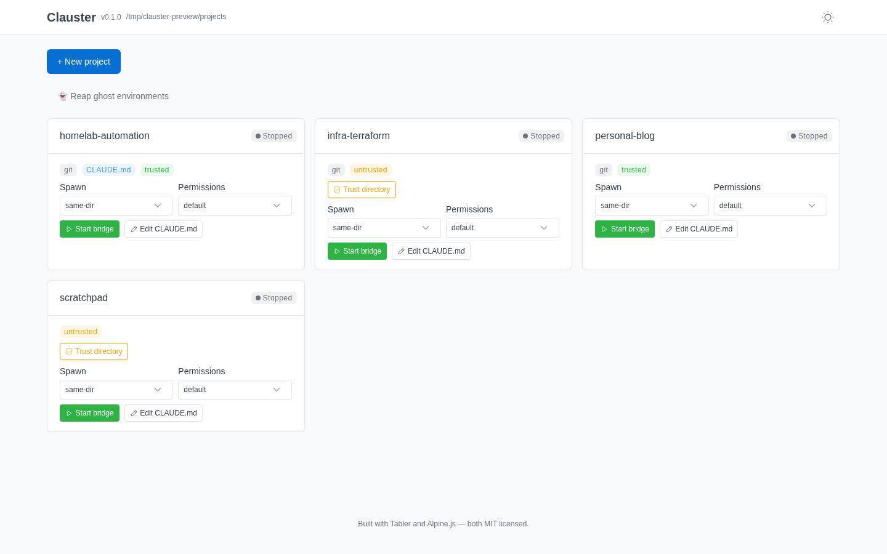
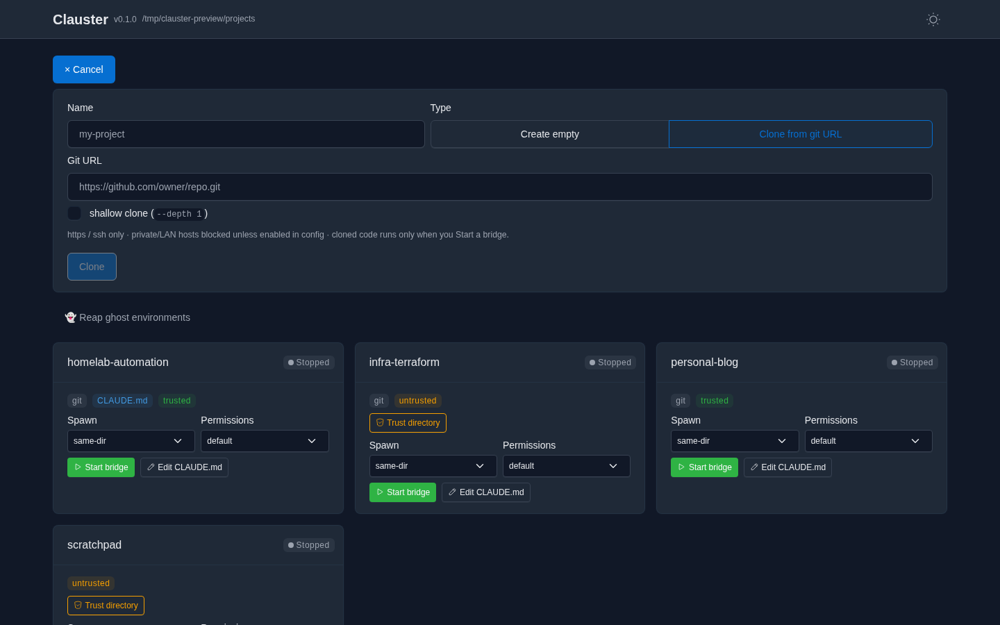
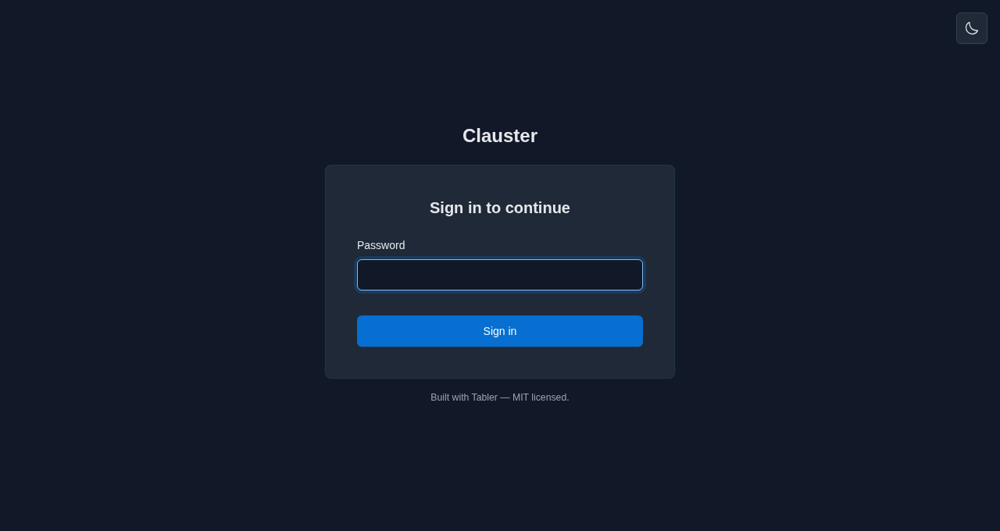

<h1 align="center">Clauster</h1>

<p align="center">
  <em>A self-hosted web UI for spawning and managing Claude Code <code>remote-control</code><br>
  bridges into any project directory on a remote host — from any browser or the Claude mobile app.</em>
</p>

<p align="center">
  <a href="https://github.com/schubydoo/clauster/actions/workflows/ci.yml"></a>
  <a href="https://github.com/schubydoo/clauster/actions/workflows/lint.yml"></a>
  
  <a href="https://github.com/schubydoo/clauster/pkgs/container/clauster"></a>
  <a href="LICENSE"></a>
</p>

<p align="center">
  
</p>

Anthropic's first-party tools assume terminal access on the host to spawn a bridge
in a new directory. Clauster fills that gap: a browser-based dispatcher of
`claude remote-control` instances on a remote machine (NAS, homelab box). You pick
a project, start a bridge, and attach to it from `claude.ai/code` or the mobile app
— no SSH session required.

> **Status: pre-1.0, in active development.** Loopback-only by default; password and
> reverse-proxy auth are available for networked deployments (see
> [Auth & networking](#auth--networking)). **No telemetry, ever.**

<table>
  <tr>
    <td width="50%" align="center">
      <br>
      <sub><b>Dark / light</b> — theme toggle persists across reloads</sub>
    </td>
    <td width="50%" align="center">
      <br>
      <sub><b>Create or clone</b> — SSRF-guarded, cloned code runs only on Start</sub>
    </td>
  </tr>
  <tr>
    <td width="50%" align="center">
      <br>
      <sub><b>Password login</b> — for non-loopback / networked deploys</sub>
    </td>
    <td width="50%" align="center" valign="middle">
      <sub>Every action is reactive — cards insert, badges flip, and clone progress<br>
      streams without a full-page reload. Self-hosted assets; no CDN, no trackers.</sub>
    </td>
  </tr>
</table>

## Features

Everything below is implemented and shipping. Items marked **(opt-in)** are gated
behind a config flag and off by default — the flag is named inline so you can find
it in [`clauster.yml.example`](clauster.yml.example).

### Projects & bridges

- **Project discovery** — one card per directory under `projects_root`, with git /
  `CLAUDE.md` / trust badges.
- **Bridge lifecycle** — start / stop / **restart** bridges; live status
  (Starting / Running / Stopped / Crashed). A bridge that launches but never
  registers an environment is reported honestly as `ERROR` after a grace window,
  not a phantom `Running`.
- **Spawn controls** — pick the spawn mode (same-dir / worktree / session) and
  permission mode per launch. `bypassPermissions` is double-gated: a per-project
  config ceiling (`projects.<name>.allow_bypass_permissions`) **and** a
  type-the-project-name confirm in the UI.
- **Open in Claude** — primary session deep link + a scannable QR code for
  attaching from your phone.
- **External session surfacing** — sessions you started from a terminal or Desktop
  (not via Clauster) are discovered and shown with a distinct indicator.
- **Create / clone projects** — make a new project or clone a git URL, with SSRF
  guards, transport lockdown, a size cap, and a "code runs on start" warning for
  cloned repos. Clones stream **live progress** over a WebSocket and never
  auto-spawn (they land discovered-but-stopped).

### Visibility & editing

- **Live log tail** — the bridge debug log streamed over a WebSocket, ANSI-stripped
  and ID-redacted (`env_`/`session_`/`cse_` IDs, bare UUIDs, and secret-shaped
  tokens — API keys, bearer headers). Redaction is hybrid by default (verbatim on
  disk, redacted over the wire); `logs.redact_session_url` redacts on disk too.
- **CLAUDE.md editor** — view/edit a project's `CLAUDE.md` from the dashboard
  (size-capped, lost-update-guarded, trust-gated, audit-logged).
- **Per-project cost badge** — approximate USD + token totals rolled up from a
  project's session transcripts.

### Safety

- **Workspace trust** — a "Trust directory" action writes the Claude workspace-trust
  flag before spawning; untrusted directories are refused.
- **Auto-enable remote control** — before the first spawn, Clauster marks remote
  control as acknowledged in the runtime user's `~/.claude.json` so a detached-stdin
  bridge isn't stuck on the one-time interactive "Enable Remote Control?" prompt. On
  by default (`claude.auto_enable_remote_control`); set false to manage it yourself.

### Opt-in extras

- **Conversation recap on restart (opt-in)** — `claude remote-control` restarts into
  a fresh, empty context, so a restarted bridge "forgets" the prior conversation.
  With `claude.resume_recap` enabled, Clauster installs a `SessionStart` hook in the
  runtime user's Claude settings that recaps the most recent prior transcript for
  that directory back into the new session.
- **Native true-resume / "PTY mode" (opt-in, POSIX)** — `claude.resume_mode: pty`
  runs the `claude --remote-control` flag form under a PTY *keeper* sidecar, which
  **genuinely restores prior conversation context** on Restart (`--continue`) rather
  than recapping it. The keeper outlives a Clauster restart and is stopped by signal.
  Single-session (vs. the default multi-session server). *Backend shipped; the
  dashboard mode indicator + cross-restart UI rediscovery are in progress —
  see [Roadmap](#roadmap).*
- **Ghost-environment reaper** — find and archive/delete the server-side bridge
  environments that outlive their bridge and clutter the claude.ai/code "New session"
  selector. The CLI (`clauster reap-environments`) is always available; the
  **dashboard UI is opt-in** (`reaper.ui_enabled`) because it exposes a destructive
  first-party API in the browser. Archive is reversible; force-delete requires
  typing `DELETE`.

## Quick start (dev)

```sh
uv sync --extra dev
cp clauster.yml.example clauster.yml    # edit projects_root
uv run clauster
```

Then open <http://127.0.0.1:7621>. `claude` must be on your `PATH` (Clauster spawns
it; it isn't vendored).

## Docker

Multi-arch images (`linux/amd64`, `linux/arm64`) are published to GHCR on each release:

```sh
docker run -d --name clauster \
  -p 7621:7621 \
  -e PUID=1000 -e PGID=1000 \
  -e CLAUSTER_AUTH_PASSWORD_HASH="$(clauster hash-password)" \
  -v /path/to/config:/config \
  -v /path/to/projects:/projects \
  ghcr.io/schubydoo/clauster:latest
```

- The image binds `0.0.0.0`, which **requires auth** — set `CLAUSTER_AUTH_PASSWORD_HASH`
  (or put it in `/config/clauster.yml`) or the container exits on start.
- `/config` holds `clauster.yml` + state; `/projects` is your `projects_root`.
  `PUID`/`PGID` remap the runtime user to own bind-mounts.
- `claude` is **not** baked in — tell Clauster where it is one of two ways: mount the
  binary somewhere on the container `PATH` (the default `claude.binary: claude` is
  resolved via `PATH`), **or** set `CLAUSTER_CLAUDE_BINARY=/abs/path/to/claude` (a.k.a.
  `claude.binary`) to an absolute path you've mounted anywhere. Either way, also mount
  the runtime user's `~/.claude` credentials — or build a derived image that installs
  `claude`.
- Logs are JSON by default (`CLAUSTER_LOG_FORMAT`); health is at `/healthz`. Images
  are cosign-signed with build provenance + SBOM attestations.

## Auth & networking

Loopback (`127.0.0.1`) needs no auth. Binding to a non-loopback address is refused
unless you enable one of: password login (`auth.password_required` + a hash from
`clauster hash-password`), reverse-proxy trust (peer-IP allowlist + HMAC header), or
an explicit `auth.allow_unauthenticated_network` opt-out for a trusted LAN. Sessions
are signed cookies with server-side revocation ("log out everywhere"); WebSocket
connections are authenticated before accept and origin-checked.

## Configuration

All settings live in `clauster.yml` — see
[`clauster.yml.example`](clauster.yml.example) for the full, commented schema. Any
scalar key is overridable by an environment variable of the form
`CLAUSTER_<UPPER_SNAKE_PATH>`. The schema is additive-only — old configs always
validate against newer versions.

| Common flag | Default | What it does |
|---|---|---|
| `host` / `port` | `127.0.0.1` / `7621` | bind address (non-loopback needs auth) |
| `projects_root` | — | directory whose children become project cards |
| `auth.password_required` | `false` | require login (`clauster hash-password` for the hash) |
| `claude.resume_recap` | `false` | recap the prior transcript into a restarted bridge |
| `claude.resume_mode` | `standard` | `pty` = native true-resume on Restart (POSIX) |
| `reaper.ui_enabled` | `false` | expose the ghost-environment reaper in the dashboard |
| `logs.redact_session_url` | `false` | redact the session URL on disk too, not just over WS |

## CLI

```
clauster run                  # start the server (default)
clauster hash-password        # generate an argon2id hash for auth
clauster doctor               # diagnose config / environment
clauster backup | restore | migrate
clauster install-service {systemd|launchd|windows}
clauster reap-environments    # reap ghost bridge environments (dry-run by default)
clauster usage <transcript>   # token + approximate cost for a session transcript
```

## Roadmap

Planned work, roughly in priority order — the public-facing companion to the in-repo
`scratch/TODO.md`.

- **PTY mode — finish the slice** — the backend for native true-resume ships today
  (`claude.resume_mode: pty`); next is the dashboard mode indicator and cross-restart
  UI rediscovery of PTY bridges (the keeper process already survives a restart).
- **Public API** — promote the existing `/api/*` routes to a documented, versioned,
  auth-gated contract (OpenAPI surface, API tokens distinct from the session cookie)
  so third parties can build their own dashboards.
- **Session naming** — predictable/branded session display names instead of the
  random adjective-noun defaults; list active/resumable sessions in the UI.
- **v0.3 — multi-user** — per-user accounts (OIDC via Authentik / Pocket-ID /
  Keycloak / Zitadel), a real persistence layer (SQLAlchemy + Alembic), and GDPR
  controller tooling (`clauster user export` / `delete`).
- **v0.3 — operability** — crash notifications (Apprise / webhooks), a `/metrics`
  Prometheus endpoint, a homepage-dashboard widget endpoint, and i18n string extraction.
- **Wiki** — a proper docs site (setup, deployment recipes, config reference, security
  model) beyond this README.

## Stack

Python 3.11+ · FastAPI · Alpine.js + Jinja2 + Tabler · `uv` · `pydantic`. Developed
and CI-gated on Linux; macOS / Windows are in the test matrix. Apache-2.0 licensed.

## License

[Apache License 2.0](LICENSE).
