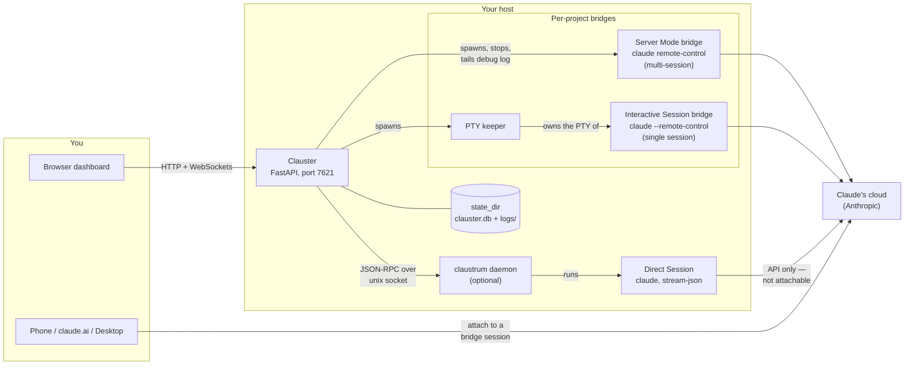

# How it works

What actually runs where when you use Clauster: which processes exist on your
host, what talks to what, and what survives a restart. This page is for the
operator deciding what to run — contributors looking for the module-level map
should read [Architecture](../architecture.md) instead. Unfamiliar words are
defined in the [Glossary](glossary.md).

## The pieces at runtime

- **Your browser** — the dashboard. Plain HTTPS/HTTP to Clauster, plus
  WebSockets for the live log tail, Direct Session view, and clone progress.
- **Clauster** — one FastAPI process (`clauster run`), listening on
  `127.0.0.1:7621` by default. It discovers projects under your
  `projects_root`, spawns and stops `claude` processes, and watches them.
- **Bridges** — one detached `claude` process per launched project. A
  Server Mode bridge is `claude remote-control` (subcommand form,
  multi-session); an Interactive Session bridge is `claude --remote-control`
  (flag form, single session) run inside a pseudo-terminal owned by a small
  **PTY keeper** sidecar.
- **Claude's cloud** — every bridge opens its own outbound connection to
  Anthropic. That connection is what makes the session show up on
  `claude.ai/code`.
- **Your phone / claude.ai / Claude Desktop** — attach to a bridge session
  through Claude's cloud. This traffic never passes through Clauster's port;
  Clauster only starts, watches, and stops the process.
- **claustrum daemon (optional)** — a separate helper daemon, present only
  when `claustrum.enabled` is set, that runs Direct Sessions: `claude`
  processes Clauster drives itself and renders in the dashboard.

## Runtime topology

## What talks to what

When you click **Run Claude here** and choose **In claude.ai / Desktop**,
Clauster spawns a bridge in the project directory (after writing the
[workspace-trust](../security.md#workspace-trust) flag if you asked it to).
The bridge registers an *environment* with Claude's cloud; once that
registration appears in the bridge's debug log, the card turns ready and shows
the **Open in Claude** link and QR code. From then on the conversation flows
directly between the bridge and Claude's cloud — attach and chat from any
Claude surface, with Clauster out of the data path.

The dashboard's live log view is Clauster tailing the bridge's debug log file
and streaming it to your browser over a WebSocket, with session URLs and
secrets redacted — see
[Reading the bridge debug log](../operations.md#reading-the-bridge-debug-log).

Choosing **Here in the browser** instead starts a **Direct Session**: Clauster
asks the claustrum daemon (over a local unix socket) to run `claude` on its
pipes, then renders the streamed conversation in its own panel — including
tool-permission prompts you approve or deny there.

!!! note "Direct Sessions are local-only"
    A bridge is cloud-visible: attachable from `claude.ai/code` and the mobile
    app. A Direct Session streams only in this dashboard and is *never*
    attachable from the Claude app — opening it on your phone is a dead end by
    design.

## Where state lives

Everything Clauster persists sits under `state_dir` (default `~/.clauster`):

| Path | What it holds |
| --- | --- |
| `clauster.db` | The SQLite database: bridge and Direct Session records, and the session-event history. Migrated automatically (and fail-closed) on startup. |
| `logs/` | Per-spawn bridge debug logs, `<label>-<timestamp>-<seq>.log`, plus their stderr/keeper siblings. Rotation and retention are configurable. |
| `claustrum/` | The claustrum daemon's socket and auth token. |
| `backups/` | Automatic pre-migration snapshots of `clauster.db`. |

Live facts — PIDs, environment ids, session URLs, running/stopped status — are
deliberately *not* persisted: Clauster re-derives them from the processes and
from `claude agents --json` every time it starts. The full inventory is in
[Privacy & data at rest](../privacy.md#at-rest-inventory).

## What survives a restart

Bridges are spawned detached, in their own process group, precisely so that
restarting Clauster does not take your sessions down:

| After restarting Clauster | What happens |
| --- | --- |
| Server Mode bridge | Keeps running; Clauster re-derives its status and the dashboard reattaches. |
| Interactive Session bridge | Keeps running — the PTY keeper, not Clauster, owns its terminal, and the keeper outlives the restart. |
| Direct Session | The claustrum daemon keeps running (it outlives Clauster) and, by default, keeps its `claude` children alive too; Clauster reconnects and reattaches the sessions recorded in `clauster.db`. |
| The database | `clauster.db` is stable across restarts; schema migrations run automatically on startup. |

Restarting a *bridge* is a different question: a Server Mode bridge comes back
with a fresh, empty context (the opt-in `claude.resume_recap` hook can recap
the prior transcript), while an Interactive Session genuinely restores the
prior conversation — see
[The two bridge modes](../index.md#the-two-bridge-modes).

!!! warning "systemd can undo all of this"
    The survival table assumes nothing reaps the child processes. Under a
    systemd unit with the default `KillMode=control-group`, a
    `systemctl restart` kills every process in the group — bridges and keepers
    included. The unit `clauster install-service` writes uses
    `KillMode=process`, which restarts only Clauster itself. See
    [the restart caveat](../operations.md#restart) and
    [Upgrading](../upgrading.md).
